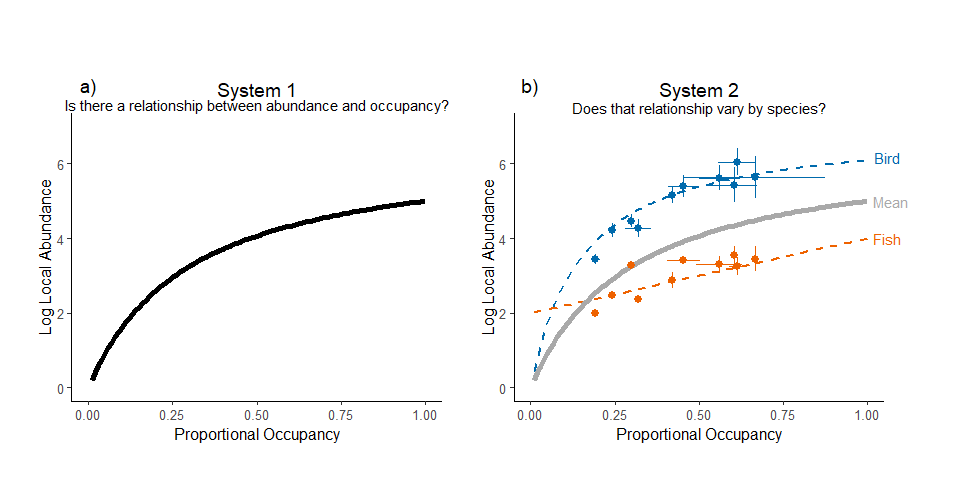

Walkthrough code for figures
================
Matthew Robertson
21/10/2022

## Figure 1 Abundance-Occupancy

We will first load the two packages necessary for creating all three
figures in the manuscript.

``` r
library(tidyverse)
library(patchwork)
```

Figure 1 was created using simulated data, so the first step is creating
the basic relationship for panel a).

``` r
#generate random occupancy between 0 and 1
x<-seq(from=0.01, to=1, by=0.01)

#generate mean relationship for abundance following saturating function
meany<-6.5*x/(0.3^1+x^1)
```

These data are then put into a dataframe and plotted using ggplot.

``` r
#put all data into one dataframe
ao_df<-data.frame(x=x, y=meany)

#plot mean relationship
p1<-ggplot(ao_df, aes(x=x, y=y))+
  geom_line(size=2)+
  xlab("Proportional Occupancy")+
  ylab("Log Local Abundance")+
  theme_grey(base_size = 12)+ #choose basic theme and modify text size
  coord_cartesian(xlim=c(0,1),ylim=c(0,7),clip = 'off')+ #set x and y limits
  #remove some of the figure components (grid lines)
  theme(panel.grid.major = element_blank(), panel.grid.minor = element_blank(),
        panel.background = element_blank(), axis.line = element_line(colour = "black"))+
  #set the margins around the plot
  theme(plot.margin=unit(c(3,1,1,1),"cm"))+
  #add text above the figure
  annotate(geom="text",x=0.5, y=7.6, label="Is there a relationship between abundance and occupancy?", size=4)+
  annotate(geom="text",x=0.5, y=8, label="System 1", size=5)+
annotate(geom="text",x=0, y=8.1, label="a)", size=5)
```

<!-- -->

Panel b) in Figure 1 required multiple lines and points and the data for
these lines and points needed to initially be simulated.

``` r
#generate slightly modified relationships for species specific curves
diff_y<-7*x/(0.15^1+x^1)

diff_y2<-2+2*x

#put all data into a dataframe for the lines in panel 2
ao_df_lines<-data.frame(x=rep(x,3), y=c(meany,diff_y,diff_y2), spp=rep(c("mean","bird","fish"), each=length(x)),
                        lwd=rep(c(2,1,1), each=length(x)))

#generate data for points around the lines
#random values between 0 and 1
newx<-rbeta(10, 2, 5)

#same relationships as before but with new x data
diff_y<-7*newx/(0.15^1+newx^1)+rnorm(10,0,0.3)

diff_y2<-2+2*newx+rnorm(10,0,0.3)

#setseed for sd bars since some random values are huge
set.seed(101)
#combine all point data to use in panel 2
ao_df_complex<-data.frame(x=newx, diffy=diff_y, diffy2=diff_y2, sdbirdy=rbeta(10,5,2), sdbirdx=rbeta(10,0.8,10),
                          sdfishy=rbeta(10,2,5), sdfishx=rbeta(10,0.3,10))
```

Once the simulation data were created and added to a dataframe they
could be plotted using their own ggplot object.

``` r
p2<-ggplot()+
  geom_line(data=ao_df_lines, aes(x=x, y=y, group=spp, color=spp, size=spp, linetype=spp))+
  #set point sizes, line colors, and line types
  scale_size_manual(values=c(1,1,2))+
  scale_color_manual(values=c('#006AAC','#EE6200','darkgrey'))+
  scale_linetype_manual(values=c("dashed","dashed","solid"))+
  #add the sd values in the x and y directions for the points
  geom_pointrange(data=ao_df_complex,aes(ymin=diffy-sdbirdy*newx, ymax=diffy+sdbirdy*newx,
                                         x=newx, y=diffy),col="#006AAC")+
  geom_pointrange(data=ao_df_complex, aes(xmin=newx-sdbirdx*newx, xmax=newx+sdbirdx*newx,
                                         x=newx, y=diffy),col="#006AAC")+
  geom_pointrange(data=ao_df_complex,aes(ymin=diffy2-sdfishy*newx, ymax=diffy2+sdfishy*newx,
                                         x=newx, y=diffy2),col="#EE6200")+
  geom_pointrange(data=ao_df_complex, aes(xmin=newx-sdfishx*newx, xmax=newx+sdfishx*newx,
                                          x=newx, y=diffy2),col="#EE6200")+
  xlab("Proportional Occupancy")+
  ylab("Log Local Abundance")+
  #modify theme to match panel a
  theme_grey(base_size = 12)+
  coord_cartesian(xlim=c(0,1),ylim=c(0,7),clip = 'off') + 
  theme(panel.grid.major = element_blank(), panel.grid.minor = element_blank(),
        panel.background = element_blank(), axis.line = element_line(colour = "black"))+
  theme(legend.position = "none")+
  theme(plot.margin=unit(c(3,2,1,0),"cm"))+
  #add text to plot
  annotate(geom="text",x=1.06, y=6.17, label="Bird", size=4,col="#006AAC")+
  annotate(geom="text",x=1.07, y=5, label="Mean", size=4,col="darkgrey")+
  annotate(geom="text",x=1.06, y=4, label="Fish", size=4,col="#EE6200")+
  annotate(geom="text",x=0.5, y=7.5, label="Does that relationship vary by species?", size=4)+
  annotate(geom="text",x=0.5, y=8, label="System 2", size=5)+
  annotate(geom="text",x=0, y=8.1, label="b)", size=5)
```

<!-- -->

These panels could then be plotted together and saved as a jpeg or pdf.

``` r
gridExtra::grid.arrange(p1, p2, nrow = 1)
```

<!-- -->

``` r
jpeg("AO_plot_thi_grey_mean.jpeg", units="in", res=400, width=10, height=5)
gridExtra::grid.arrange(p1, p2, nrow = 1)
dev.off()

pdf("AO_plot.pdf", width=10, height=5)
gridExtra::grid.arrange(p1, p2, nrow = 1)
dev.off()
```

## FIGURE 2 Logistic Growth Example

Similar to Figure 1, Figure 2 required the creation of simulated data,
however, the data were the same for all three panels. Data simulation
was relatively straightforward, requiring a logistic equation where
points were modified to add some noise.

``` r
#x values from 1 to 50
x<-seq(from=1, to=50, by=1)

#use those x for a logistic growth curve with random variability
y<-95/(1+exp(-0.25*(x-25)))+rnorm(50,0,3)

# make sure the noise doesnt add values below 0
y<-ifelse(y<0, rnorm(1,5,1), y)

#put into data frame and change colors of points after a certain timestep
log_df<-data.frame(effort=x, yield=y, overfished=ifelse(x>25, "red", "black"))
```

Panel a) about reading data just required plotting the points that we
had just created.

``` r
p1<-ggplot(log_df, aes(x=effort, y=yield))+
  geom_point(size=1)+xlab("Time")+
  ylab("Population size")+
  theme_grey(base_size = 12)+
  xlim(0,50)+ylim(0,105)+
  theme(panel.grid.major = element_blank(), panel.grid.minor = element_blank(),
        panel.background = element_blank(), axis.line = element_line(colour = "black"))+
  annotate(geom="text",x=25, y=105, label="Read data", size=5)+
  annotate(geom="text",x=2, y=105, label="a)", size=5)
```

<!-- -->

Panel b) then required overlaying the underlying relationship that
created those points.

``` r
p2<-ggplot(log_df, aes(x=effort, y=yield))+
  #add a line regarding the underlying relationship that had been used for data creation
  stat_function(fun=function(x) 95/(1+exp(-0.25*(x-25))), size=1.5, linetype="dashed")+
  geom_point(colour="grey",size=1)+xlab("Time")+
  ylab("Population size")+
  theme_grey(base_size = 12)+
  xlim(0,50)+ylim(0,105)+
  theme(panel.grid.major = element_blank(), panel.grid.minor = element_blank(),
        panel.background = element_blank(), axis.line = element_line(colour = "grey"),
        axis.text.x = element_text(colour = "grey"), axis.text.y = element_text(colour = "grey"), axis.ticks=element_line(colour="grey"),
        axis.title = element_text(colour="grey"))+
  annotate(geom="text",x=29, y=105, label="Read between data", size=5)+
  annotate(geom="text",x=2, y=105, label="b)", size=5)
```

<!-- -->

Panel c) was the final step which involved identifying the mid-point of
the logistic relationship and specifying seperate colors for points
above and below the midpoint.

``` r
p3<-ggplot(log_df, aes(x=effort, y=yield, colour=overfished))+
  stat_function(fun=function(x) 95/(1+exp(-0.25*(x-25))), size=1.5, linetype="dashed", colour="grey")+
  #add segments to identify the mid-point of the relationship
  geom_segment(aes(x=0, xend=25, y=50, yend=50), colour="#EE6200", size=1.5, linetype="dotted")+
  geom_segment(aes(x=25, xend=25, y=0, yend=50), colour="#EE6200", size=1.5, linetype="dotted")+
  geom_point(size=1)+scale_colour_manual(values=c("black","#EE6200"))+
  scale_colour_manual(name="Effort", labels=c("<50", ">50"), values=c("black","#EE6200"))+
  guides(color=guide_legend(override.aes=list(fill=NA)))+
  xlab("Time")+
  ylab("Population size")+
  theme_grey(base_size = 12)+
  xlim(0,50)+ylim(0,105)+
  theme(legend.position = "none")+
  #theme(legend.position = c(0.9, 0.8))+
  #theme(legend.background = element_rect(fill="white",
                                           #size=0.5, linetype="solid", 
                                           #colour ="black"))+
  #theme(legend.key=element_blank())+
  theme(panel.grid.major = element_blank(), panel.grid.minor = element_blank(),
        panel.background = element_blank(), axis.line = element_line(colour = "grey"),
        axis.text.x = element_text(colour = "grey"), axis.text.y = element_text(colour = "grey"), axis.ticks=element_line(colour="grey"),
        axis.title = element_text(colour="grey"))+
  #annotate(geom="text",x=25, y=55, label="MSY", size=4, colour="#d95f02")+
  annotate(geom="text",x=27, y=105, label="Read beyond data", size=5)+
  annotate(geom="text",x=2, y=105, label="c)", size=5)
```

<!-- -->

Finally, we could include all plots in one figure and use the same code
from Figure 1 to save the plot as a jpeg or pdf.

``` r
gridExtra::grid.arrange(p1, p2, p3, nrow = 1)
```

<!-- -->

## Figure 3 Figure Improvement

Unlike Figures 1 & 2, Figure 3 was based on the freely available CO2
dataset in R. As a result, all that was required in terms of initial
data processing was recoding factors so they were capitalized for the
figure.

``` r
CO2$Treatment <- recode_factor(CO2$Treatment, nonchilled = "Nonchilled", chilled = "Chilled")
```

Panel a) was very simple and just involved plotting barplots for
treatments, adding a title, and modifying text size.

``` r
p1 <- ggplot(CO2, aes(x = Treatment, y = uptake)) +
  geom_bar(stat = "identity") +
  theme_classic(base_size = 7) +
  ggtitle("a) Bar plot of data")
```

<!-- -->

Panel b) impvoed on this by using a boxplot rather than a barplot.

``` r
p2 <- ggplot(CO2, aes(x = Treatment, y = uptake)) +
  geom_boxplot() +
  ylab("Uptake") +
  theme_classic(base_size = 7) +
  ggtitle("b) Correct plot type")
```

<!-- -->

Panel c) plotted the underlying data behind transparent boxplots.

``` r
p3 <- ggplot(CO2, aes(x = Treatment, y = uptake)) +
  geom_jitter(width = 0, color = "darkgray") +
  geom_boxplot(alpha = 0) +
  ylab("Uptake") +
  theme_classic(base_size = 7) +
  ggtitle("c) Add data")
```

<!-- -->

Panel d) jittered the underlying data to allow better visualization of
each point.

``` r
p4 <- ggplot(CO2, aes(x = Treatment, y = uptake)) +
  geom_jitter(width = 0.1, color = "darkgray") +
  geom_boxplot(alpha = 0) +
  ylab("Uptake") +
  theme_classic(base_size = 7) +
  theme(legend.position = "none") +
  ggtitle("d) Jitter data for clarity")
```

<!-- -->

Panel e) filled and colored the boxplots and points by treatment.

``` r
p5 <- ggplot(CO2, aes(x = Treatment, y = uptake, fill = Treatment, color = Treatment)) +
  geom_jitter(width = 0.1, alpha = 0.5) +
  geom_boxplot(alpha = 0.5) +
  scale_color_manual(values = c("#E66100","#016AA8")) +
  scale_fill_manual(values = c("#E66100","#016AA8")) +
  ylab("Uptake") +
  theme_classic(base_size = 7) +
  theme(legend.position = "none") +
  ggtitle("e) Add color")
```

<!-- -->

Panel f) increased the font size from 7 to 15.

``` r
p6 <- ggplot(CO2, aes(x = Treatment, y = uptake, fill = Treatment, color = Treatment)) +
  geom_jitter(width = 0.1, alpha = 0.5) +
  geom_boxplot(alpha = 0.5) +
  scale_color_manual(values = c("#E66100","#016AA8")) +
  scale_fill_manual(values = c("#E66100","#016AA8")) +
  ylab("Uptake") +
  theme_classic(base_size = 15) +
  theme(legend.position = "none") +
  ggtitle("f) Increase font size")
```

<!-- -->

Panel g) was the final improvement which involved using `facet_wrap` to
create small multiples by location from where the treatments occurred.

``` r
p7 <- ggplot(CO2, aes(x = Treatment, y = uptake, fill = Treatment, color = Treatment)) +
  geom_jitter(width = 0.1, alpha = 0.5) +
  geom_boxplot(alpha = 0.5) +
  scale_color_manual(values = c("#E66100","#016AA8")) +
  scale_fill_manual(values = c("#E66100","#016AA8")) +
  ylab("Uptake") +
  theme_classic(base_size = 15) +
  theme(legend.position = "none") +
  facet_wrap(~Type) +
  ggtitle("g) Use small multiples with consistent colors")
```

<!-- -->

Finally, Figure 3 assembled all individual plots using the `patchwork`
package rather than `gridExtra`.

``` r
(p1 | p2) / (p3 | p4) / (p5 | p6) /p7
```

<!-- -->
